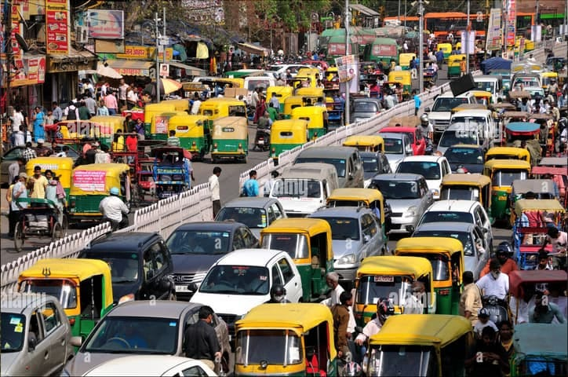

# **कहाँ फँसे हो? ट्रैफिक जाम में?**

ऐसे समय पर यह विचार ही नहीं आता कि इसे मैं रोज़ क्यों सहूँ? लगता है यह तो जीवन का हिस्सा ही है।

आचार्य जी ने गीता के अध्याय 1 का सार समझाते हुए कहा था - =="प्रदूषण हो, आतंकवाद हो, अतिवाद हो, उग्रवाद हो, पशु हिंसा हो, आप संसार की कोई भी समस्या ले लीजिए, क्या उसका संबंध मानव वृत्ति से नहीं है? आपके जीवन में वृत्तिगत समस्याएँ है तो उनका समाधान बस गीता में है।"==

## गतिविधि बिंदु:

1. अवलोकन करें कि ट्रैफिक जाम जैसी छोटी दिखने वाली पर रोज़ हमारा अच्छा-खासा समय लेने वाली समस्या का मूल कारण क्या है और इसका वास्तविक समाधान क्या है?
2. अपनी दिनचर्या से ऐसे और उदाहरण दें जिनमें आप ऐसी समस्याएँ रोज़ झेलते हैं, पर वो जीवन का हिस्सा बन गई हैं और उनपर कभी प्रश्न नहीं करते।

### गतिविधि बिंदु 1:

ट्रैफिक जाम की समस्या की तस्वीर देख कर पहली बात जो आई मन में वो थी ये श्लोक। 👇👇

##### **श्रीमद्भगवद्गीता (अध्याय 3, श्लोक 32)**

==ये त्वेतदभ्यसूयन्तो नानुतिष्ठन्ति मे मतम्।\
सर्वज्ञानविमूढांस्तान्विद्धि नष्टानचेतसः।।३२।।==

**भावार्थ:** जो अज्ञान से बँधकर, अँधेरे से बँधकर, जहाँ कोई रोशनी नहीं है (‘असूया’), मेरी बात नहीं मानते, उनको नष्ट ही समझ लेना; भविष्य में नहीं नष्ट होंगे, वो वर्तमान में ही नष्ट हैं। उनका आगे नहीं कुछ बुरा होगा, वो हैं ही नहीं कि उनका आगे कुछ बुरा हो; वो नष्ट हो चुके हैं।

**काव्यात्मक अर्थ:** अहंकार में, अंधकार में, अज्ञान में, मतिभ्रष्ट हैं। कल उन्हें क्या कष्ट हो, वो आज ही जब नष्ट हैं।

---

**ट्रैफिक जाम में मूल कारण:**

- हमारा अहंकार = मैं हूँ, और मैं विशेष हूँ। ❌
- हमारा अंधकार = मैं विशेष हूँ इसीलिए बाकि लोगों से अधिक भोगना मेरा अधिकार है। ❌
- हमारा अज्ञान = विशेष हूँ, और विशेष करता हूँ भोगना तो प्रकृति के प्रसाद जैसा है मेरे लिए। ❌

हमारा होना ही हमारा अहंकार है, लेकिन व्यावहारिक तल पर कहा जाए तो हम इस पर ध्यान नहीं देते कि हम है। हम इस पर ज्यादा ध्यान देते है कि ==हम विशेष है। ❌== जैसे कि शुरुवात करे तो अपने ==मनुष्य होने पर== हमे लगता है कि हम विशेष हैं। और ==बाकि जानवरों से ऊँचे है ❌==, ऐसा हमे लगता है। फिर जानवरों से आगे बढ़ते है तो फिर ==मनुष्य मनुष्य से ही विशेष== होने में लग जाता है।

चूंकि विशेष होने के लिए उसे लगता है कुछ पाना पड़ेगा भौतिक तौर पर तो वो भोगना शुरू कर देता है। और जब पाने के बाद उसे लगने लगता है कि उसने कुछ पा कर कुछ विशेष हासिल कर लिया है तो वह फिर और भोगने लगता है ये कह कर कि क्योंकि विशेष हूँ तो ==भोगना तो इनाम है मेरा। ❌==

तो देखा जाए तो ==जानवरों से विशेष हूँ, ❌== ये **मानकर(जाना नहीं बस माना हैं)**, ==प्रकृति पर कब्ज़ा ❌== कर लिया हमने, ==खुद को राजा मान के बैठ गए ❌== है। फिर जब देखा कि बाजु वाला भी तो मनुष्य है और ==वो भी राजा है ❌== तो उससे आगे निकलने के चक्कर में ==चीज़ें पकड़ना शुरू ❌== कर दिया, फिर बाजु वाले ने भी देखा सीखी वही करना शुरू कर दिया और भोग का बड़ा खेल चालू हो गया।

_उसके पास गाडी है तो मैं भी गाडी लूँगा, वो 1 गाडी लेगा मैं 2 गाडी लेकर विशेष बनूँगा। उसने फलाना गाडी ले ली मैं फलाना फलाना गाडी ले लूँगा। वो सब्जी लेने अब बाइक से जाता है, मैं अपनी कार से दूध लेने जाऊंगा क्योंकि विशेष हूँ मैं।_

तो इस तरह से ==मनुष्य की मतिभ्रष्ट== हैं। और ==विशेष होने के चक्कर में मनुष्य कष्ट== में है। दुःख में हैं। और साथ ही प्रकृति को ==भोग भोग कर नष्ट== कर रहा हैं।

**वास्तविक समाधान:** एक वाक्य में कहे तो **आत्मज्ञान ही हैं इसका समाधान।**, **आध्यतम हैं इसकी सीढ़ी।**, **आत्मा हैं गुरु।**

==बिना तोले मदवा पीने की जरुरत हैं हमे। 😂 😎 🆒==

### गतिविधि बिंदु 2:

**ट्रैफिक जाम की तरह कुछ भौतिक समस्याएं जो जीवन का हिस्सा सी बन गई हैं:**

- **कूड़े कचरे में या के साथ जीना।** = मैं 1992 मैं पैदा हुआ था तो मैंने अपने आसपास बहुत सी हरियाली और सफाई देखी और सीखा हैं साफ-सफाई से रहना लेकिन अब हमने कचरे में जीना जीवन का हिस्सा बना लिया हैं। हर 10 मिनट बाद आपको ==कचरे का ढेर== लग जाता हैं जिसे हम कभी देखते हैं, कभी नहीं देखते हैं लेकिन इस समस्या के लिए कुछ करते नहीं हैं न बात करते हैं। और अपनी जिम्मेदारी सरकार की जिम्मेदारी बता कर निकल जाते हैं आगे।
- **पन्नी का हद्द से ज्यादा इस्तेमाल** = जब 4 रुपये का Parle-G आता था, तब बिना पन्नी वाली पैकेजिंग के। उस समय सब्जी लेने के लिए, ==किराना लेने के अपने घर के मजबूत थैला== लेके जाया करते थे। लेकिन अब पन्नी को जीवन का हिस्सा बना लिया हैं। ==सब्जी लेने जाओ, राशन लेने जाओ पन्नी, गोली दवाई लेने गए पन्नी। पन्नी पन्नी पन्नी।== हमे दिखाई ही नहीं दे रहा हैं ==जिसे हम समाधान समझ के बैठे हैं वो ही असल समस्या हैं।==
- कचरे और ट्रैफिक जैम दोनों से मिली एक समस्या और हैं जो मुझे और बाकी लोगों को भी दिखाई देते होगी, वो हैं **जगह जगह होने वाले भंडारे** 🙄 **बीच सड़क में भंडारा शुरू** हो जाता हैं। और ट्रैफिक जैम हो जाता हैं और **भंडारा खा कर दोने पूरी सड़क में फेंक दिए** जाते हैं और सवाल उठाने वाला कोई नहीं और **भंडारा खाने वाले हज़ारों में**।
- मंदिरो का पर्यटन स्थल बन जाना अब तो जीवन का हिस्सा बन गया हैं। ==मंदिर शांति के लिए होते हैं, ध्यान के लिए होते हैं। परमात्मा या जिसे हम ईश्वर कह देते हैं उसके और निकट आने के लिए होते हैं।== लेकिन जहाँ जाओ वहां बस पाखंड, बिना काम का शोर-शराबा(==भजन की जगह भोजन बाटने का हल्ला==), और ==सेल्फी मैंने ले ली आज, सेल्फी मैंने ले ली आज== चल रहा हैं। और इसे अब हम जीवन का हिस्सा मान के बैठे हैं।
